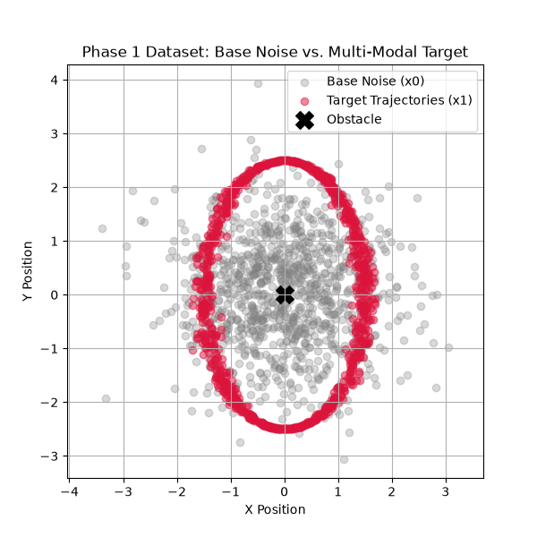
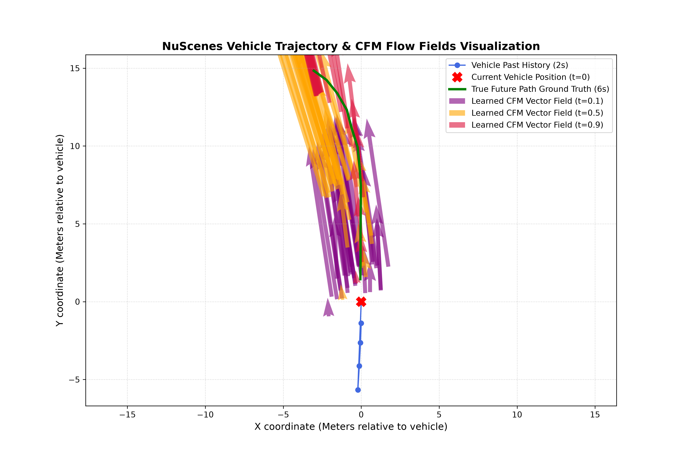
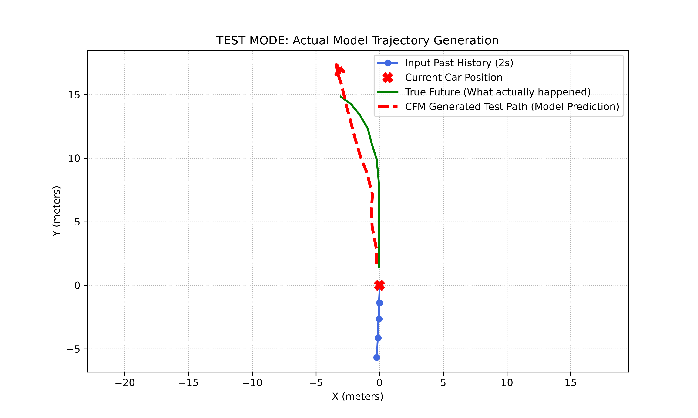

# flow-matching-trajectory-generation
Conditional Continuous Flow Matching (CCFM) in PyTorch for multi-modal trajectory generation and motion forecasting on nuScenes.

# Continuous Flow Matching (CFM) for Trajectory Generation & Motion Forecasting

[](https://pytorch.org/)
[](https://www.nuscenes.org/)
[](LICENSE)

An end-to-end implementation of **Conditional Continuous Flow Matching (CCFM)** for trajectory generation and autonomous vehicle motion forecasting. This repository bridges generative modeling and control theory by parameterizing Ordinary Differential Equations (ODEs) to synthesize smooth, multi-modal driving paths.

---

## 📌 Overview

Continuous Flow Matching (CFM) models a continuous-time probability flow by learning a time-dependent vector field $v_\theta(x_t, t, \mathbf{C})$. Unlike standard diffusion models that rely on curved, noisy paths, CFM leverages **Optimal Transport** straight-line trajectories ($x_t = (1-t)x_0 + tx_1$), enabling:
* **Fast Inference:** High-quality ODE rollouts in as few as 10 Euler integration steps.
* **Stable Training:** Objective reduced to a simple Mean Squared Error (MSE) regression loss over velocity vectors.
* **Multi-Modal Generation:** Natural bifurcation around obstacles and complex driving maneuvers.

---

## 🎨 Results & Visualizations

### 1. Phase 1: Synthetic Sandbox (Multi-Modal Obstacle Avoidance)
In the 2D sandbox, the network learns a multi-modal vector field that splits initial Gaussian base noise $x_0 \sim \mathcal{N}(0, I)$ into paths bending smoothly around a central obstacle to hit the target distribution $x_1$.

<p align="center">
  
</p>

---

### 2. Phase 2: NuScenes Vector Field Flow Visualization
Visualizing the learned velocity vector field $v_\theta(x, t, \mathbf{C})$ evaluated across flow time steps $t \in \{0.1, 0.5, 0.9\}$ conditioned on 2 seconds of vehicle past history. The vectors guide the distribution toward the ground-truth future path over a 6-second horizon.

<p align="center">
  
</p>

---

### 3. Model Inference Test (Trajectory Prediction)
Closed-loop ODE rollout during test mode comparing the generated test trajectory against the actual ground-truth trajectory ($x_1$) given the agent's 2-second history context ($\mathbf{C}$).

<p align="center">
  
</p>

---

## 📐 Mathematical Formulation

### Optimal Transport Interpolation
Given base Gaussian noise $x_0$ and target trajectory vector $x_1$:
$$x_t = (1 - t) \cdot x_0 + t \cdot x_1, \quad t \in [0, 1]$$

### Constant Target Velocity
The exact vector field along the straight line path is given by:
$$u_t(x_t) = x_1 - x_0$$

### Objective Function
The network $v_\theta$ minimizes the Conditional Continuous Flow Matching loss conditioned on historical context $\mathbf{C}$:
$$\mathcal{L}_{\text{CCFM}} = \mathbb{E}_{t, x_0, x_1, \mathbf{C}} \left[ \Vert{} v_\theta(x_t, t, \mathbf{C}) - (x_1 - x_0) \Vert{}^2 \right]$$

---

## 🛠️ Project Structure

```text
.
├── configs/
├── data/
├── Outputs/
│   ├── cfm_inference_test.png
│   ├── Noise_Multi-ModalTarget.png
│   └── vehicle_trajectory_flow_map.png
├── Src/
│   ├── Models/
│   │   └── mlp_backbone.py
│   ├── DataGeneration.py
│   ├── Main.py
│   ├── Model.py
│   └── visualization.py
├── requirements.txt
└── README.md
